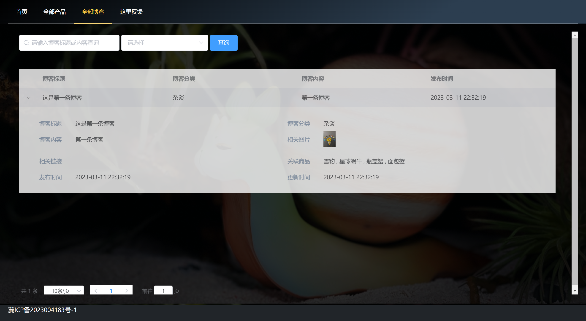
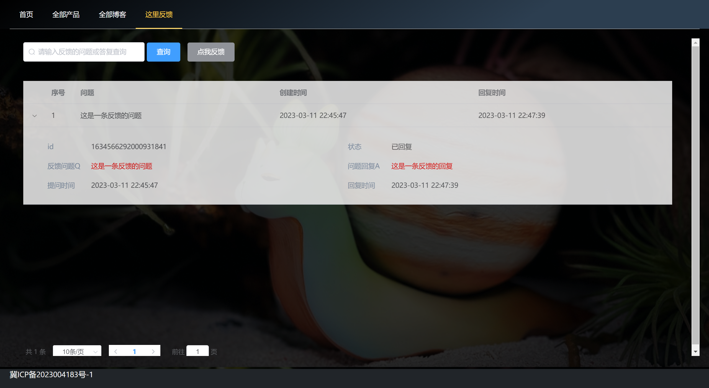
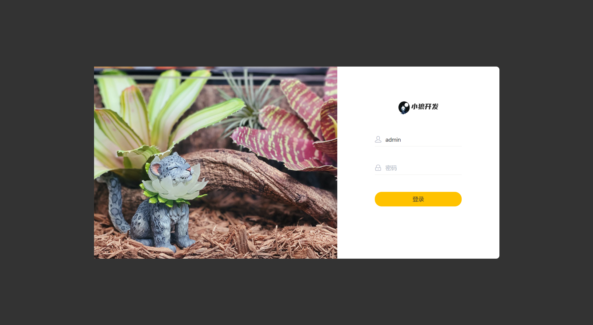
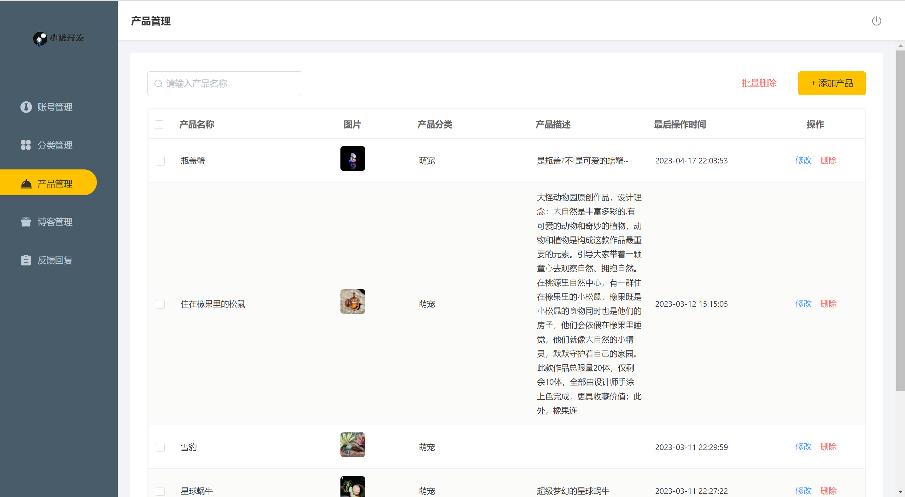
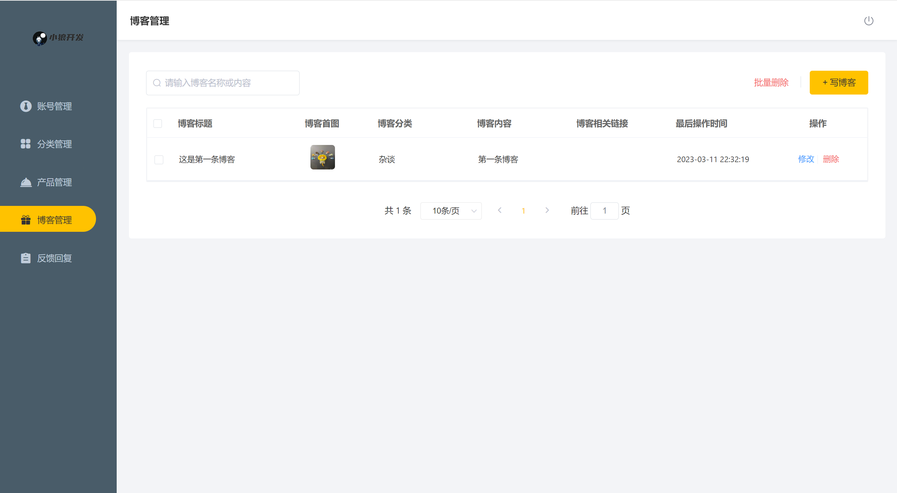

# DAGUAI-Studio-Website
#### Original Code of project(front and backend)

### Surface Performance:

1. #### User Surface :






2. #### Admin Surface









### **You need prepare  below environment below to run this project : **

- Springboot
- Maven
- Redis
- JDK 11（may run in JDK 8.0）
- MYSQL 8.0 or upon
- Windows or Linux OS
- SMS Service（optional）

### Run Preparation ： 

#### First Step：

Excute the file `daguai.sql` in path prefix-resource, and create database and data in you computer. you should get this database and tables as below when you run correctly.


#### Second Step:

修改`application.yml`文件中的`port` , `database` , `redis` 配置为适合你的 .并修改`Config`包下的`RedissonConfig.java`中的对`Redis`的配置到合适.

Modify the configuration(value) of fields that `port` , `database` , `redis` in `application.yml`.  And modify the configuration of `Redis` in `RedissonConfig.java` where in package of `Config` .

#### Third Step:

If your OS is Linux, then you should modify the `SystemContents.java` in package of `utils` , and comment the static final `WINDOWS_IMG_PATH` , cancel the comment of `LINUX_IMG_PATH` . And you should modify the value of `BATH_PATH` below to `LINUX_IMG_PATH` .

#### Fourth Step:

Run the project, and pass opening browser to test website .

WebURL Template : 

1. User Client Index : http://localhost:8080/user/index.html
2. Admin Client Login Page : http://localhost:8080/admin/page/login/login.html

#### Optional:

If you have Aliyun-SMS service and wanna enable it, then you should complete the information about it in `SMS.yml`. And open the file `AdminServiceImpl.java` in package of `service.imp`l, then cancel the comment of code: `SMSUtils.sendMessage(phone, validateCode);`

If you have not multi-database, you should open `pom.xml`, and comment the dependency of `shardingsphere` . comment all configuration of `shardingsphere` and cancel comment of configuration of `database` in `application.yml`. example as below:

```yml
#  会自动配置策略为查询操作由从数据库处理,其他操作由主数据库处理
#  multi-database configuration
  #shardingsphere:
    #datasource:
      #names:
        #master,slave
      #主数据源,名字要与上面对应
      #master:
        #type: com.alibaba.druid.pool.DruidDataSource
        #driver-class-name: com.mysql.cj.jdbc.Driver
        #url: jdbc:mysql://localhost:3306/daguai?serverTimezone=Asia/Shanghai&useUnicode=true&characterEncoding=utf-8&zeroDateTimeBehavior=convertToNull&useSSL=false&allowPublicKeyRetrieval=true
        #username: root
        #password: 123456
      #从数据源
      #slave:
        #type: com.alibaba.druid.pool.DruidDataSource
        #driver-class-name: com.mysql.cj.jdbc.Driver
        #url: jdbc:mysql://localhost:3306/daguai?serverTimezone=Asia/Shanghai&useUnicode=true&characterEncoding=utf-8&zeroDateTimeBehavior=convertToNull&useSSL=false&allowPublicKeyRetrieval=true
        #username: root
        #password: 123456
    #masterslave:
      #负载均衡多从库读写分离策略配置
      #load-balance-algorithm-type: round_robin #轮询
      #最终数据源名称
      #name: dataSource
      #主数据源名称
      #master-data-source-name: master
      #从数据源名称列表,多个之间逗号分隔
      #slave-data-source-names: slave
    #props:
      #sql:
        #show: false #控制台输出sql显示,默认false
        
      #Single-database Configuration
  datasource:
    druid:
      username: root
      password: 123456
      driver-class-name: com.mysql.cj.jdbc.Driver
      url: jdbc:mysql://localhost:3306/daguai?serverTimezone=Asia/Shanghai&useUnicode=true&characterEncoding=utf-8&zeroDateTimeBehavior=convertToNull&useSSL=false&allowPublicKeyRetrieval=true
```

# OPEN-SOURCE and LICENCE explain 

## This project ONLY open-source to Code, all of IMAGE resources that project uses are protected by Copyright. CANNOT use privately it for commercial and spread ! Other details show in file LICENCE .

#### Special Appreciation :

The programmer of user client index surface, the open-source repository url : https://github.com/wwwAlireza/company-website.git
And All of giants that are pleasure to share open-source code and knowledge .

