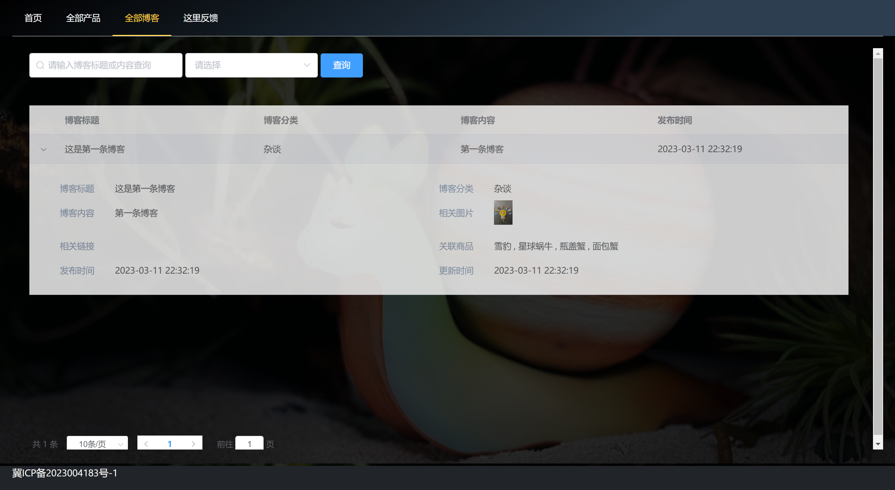
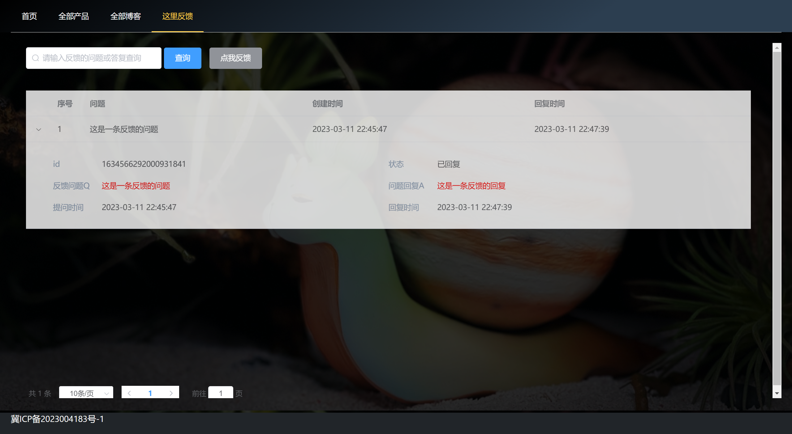
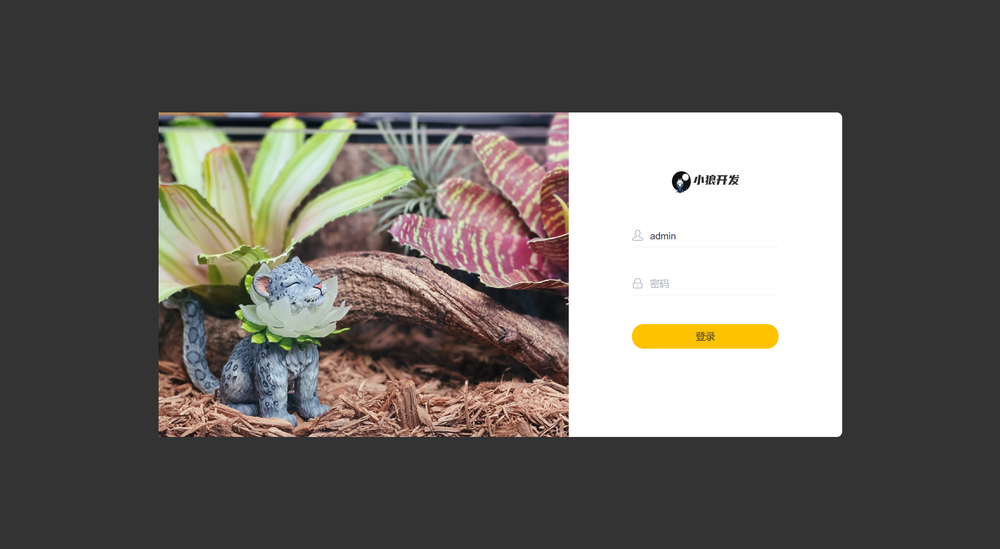
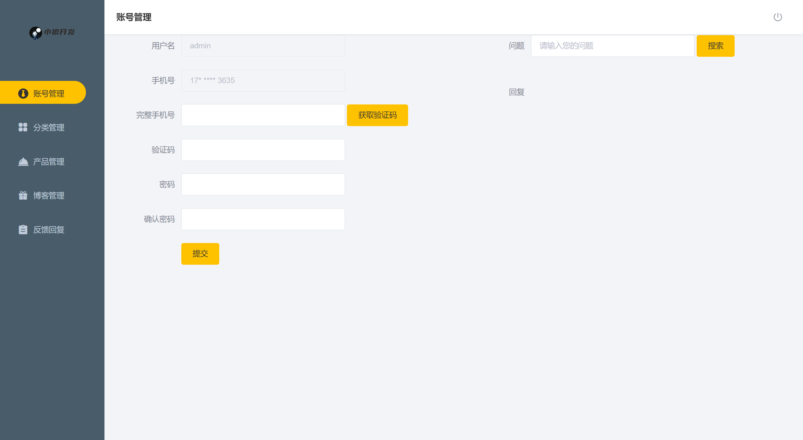
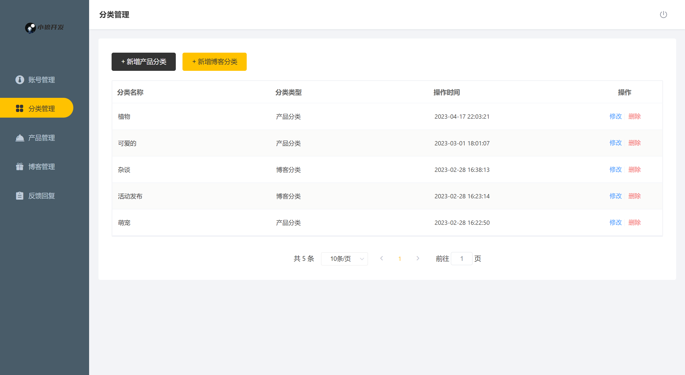
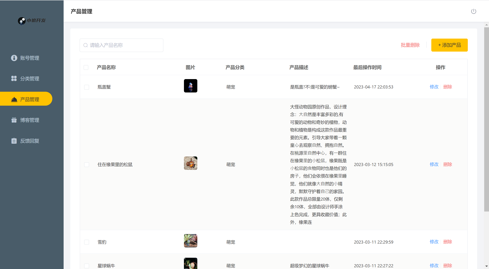
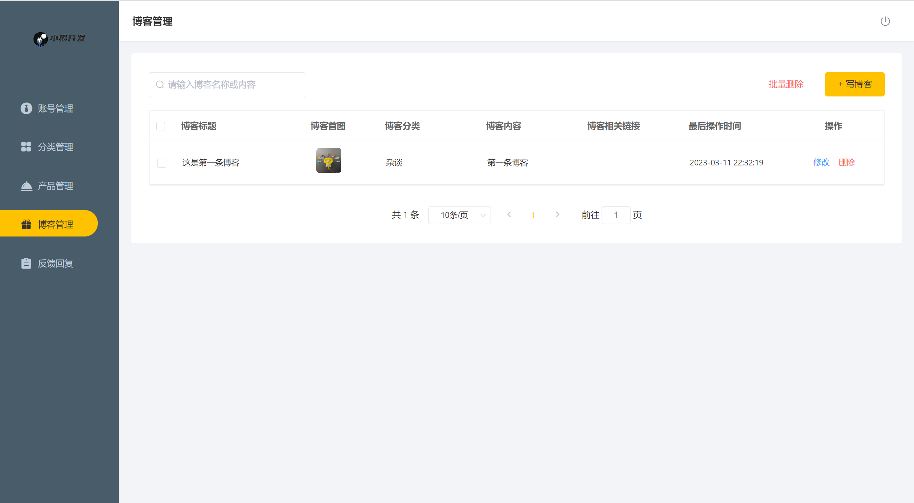
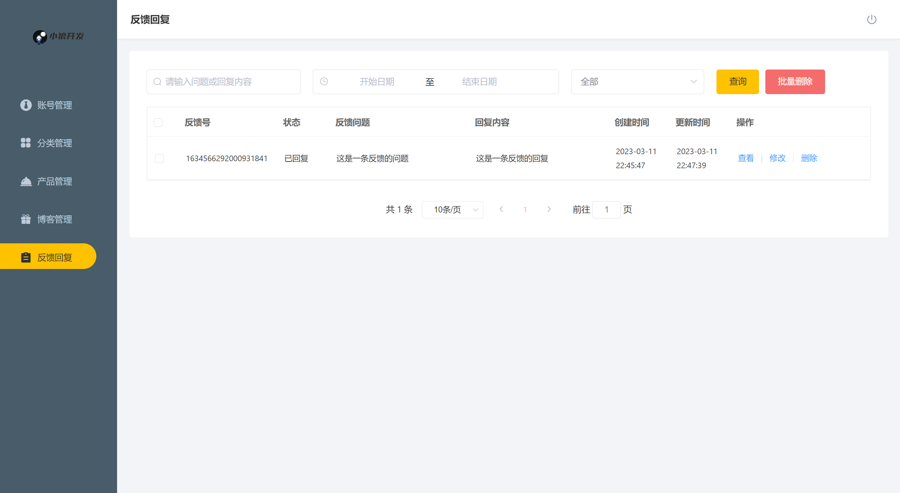

# 大怪工作室网站
#### 工程源码（前端+后端）

### 界面展示:

1. #### 用户界面 :






2. #### 管理界面













### **要运行这些程序你需要准备以下环境：**

- Springboot
- Maven
- Redis
- JDK 11（8.0可能可用）
- MYSQL 8.0或以上
- Windows 或 Linux系统电脑
- SMS服务（可选）

### 运行准备 ： 

#### 第一步：

运行将source目录下的`daguai.sql`文件，在本机上创建数据库及数据。正确运行后你应该会得到以下几个数据库和表：


#### 第二步:

修改`application.yml`文件中的`port` , `database` , `redis` 配置为适合你的 .并修改`Config`包下的`RedissonConfig.java`中的对`Redis`的配置到合适.

#### 第三步:

如果你是Linux系统环境, 则需修改`utils`包下的`SystemContents.java`文件, 将`WINDOWS_IMG_PATH`静态常量注释掉, 然后取消`LINUX_IMG_PATH`的注释, 并将下面的`BATH_PATH`改为`LINUX_IMG_PATH` .

#### 第四步:

运行项目, 成功启动后通过浏览器打开网页测试.

网址样例 : 

1. 用户端首页 : http://localhost:8080/user/index.html
2. 管理端登录页面 : http://localhost:8080/admin/page/login/login.html

#### 可选:

如果您有Aliyun-SMS服务并想启用, 则在`SMS.yml`文件中填写相关信息. 并打开`service.impl`包下的`AdminServiceImpl.java`文件, 将其中的`SMSUtils.sendMessage(phone, validateCode);` 语句取消注释.

如果您没有多个数据库, 则需要打开`pom.xml` , 将其中的`shardingsphere`依赖文件注释掉, 并在`application.yml`文件中注释掉所有`shardingsphere`配置, 并取消注释`database`配置, 如下所示:

```yml
#  会自动配置策略为查询操作由从数据库处理,其他操作由主数据库处理
  #shardingsphere:
    #datasource:
      #names:
        #master,slave
      #主数据源,名字要与上面对应
      #master:
        #type: com.alibaba.druid.pool.DruidDataSource
        #driver-class-name: com.mysql.cj.jdbc.Driver
        #url: jdbc:mysql://localhost:3306/daguai?serverTimezone=Asia/Shanghai&useUnicode=true&characterEncoding=utf-8&zeroDateTimeBehavior=convertToNull&useSSL=false&allowPublicKeyRetrieval=true
        #username: root
        #password: 123456
      #从数据源
      #slave:
        #type: com.alibaba.druid.pool.DruidDataSource
        #driver-class-name: com.mysql.cj.jdbc.Driver
        #url: jdbc:mysql://localhost:3306/daguai?serverTimezone=Asia/Shanghai&useUnicode=true&characterEncoding=utf-8&zeroDateTimeBehavior=convertToNull&useSSL=false&allowPublicKeyRetrieval=true
        #username: root
        #password: 123456
    #masterslave:
      #负载均衡多从库读写分离策略配置
      #load-balance-algorithm-type: round_robin #轮询
      #最终数据源名称
      #name: dataSource
      #主数据源名称
      #master-data-source-name: master
      #从数据源名称列表,多个之间逗号分隔
      #slave-data-source-names: slave
    #props:
      #sql:
        #show: false #控制台输出sql显示,默认false
        
      #单数据库配置
  datasource:
    druid:
      username: root
      password: 123456
      driver-class-name: com.mysql.cj.jdbc.Driver
      url: jdbc:mysql://localhost:3306/daguai?serverTimezone=Asia/Shanghai&useUnicode=true&characterEncoding=utf-8&zeroDateTimeBehavior=convertToNull&useSSL=false&allowPublicKeyRetrieval=true
```

# 开源及版权说明

## 本项目仅对代码开源, 项目使用所有图片资源均受版权保护, 未经许可严禁私自商用与传播 . 其他细节详见LICENCE文件.

#### 特此感谢 : 

用户端首页界面开发者, 开源地址 : https://github.com/wwwAlireza/company-website.git
以及每一位乐于开源与分享知识的伟人

